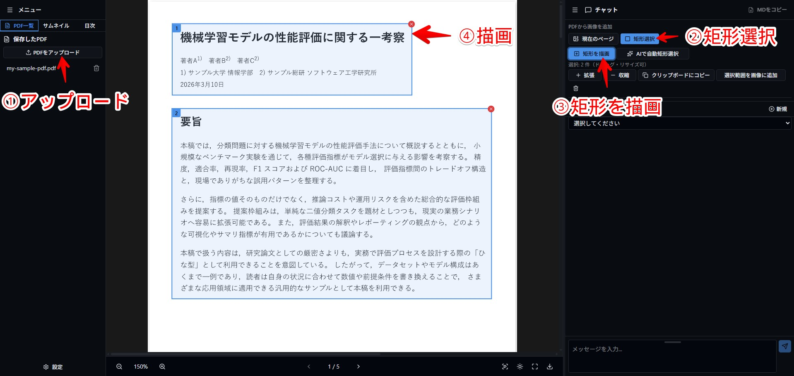
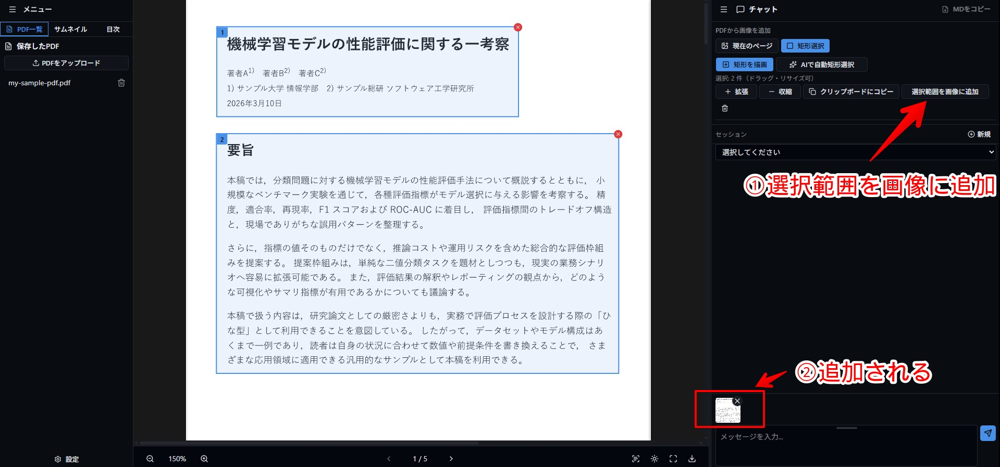
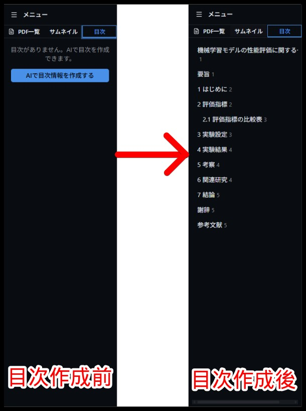

# SmartExtract PDF

SmartExtract PDF： **PDFのレイアウトを解析、AIへ質問できるOCR×AI対話リーダー** です。


## 背景

技術系の PDF を読むとき、だいたい次のような構成に出会います。

- 2 段組みで、段と段の間に図がはさまっている
- 図のキャプションがページの下にあり、説明文は次のページにまたがっている
- 本文と数式、表がページをまたいで散らばっている

そこで、「**PDF を読むときの、いい感じの読み順をそのまま UI で指定して AI に渡せるようにしよう**」と思って作ったのが 「SmartExtract PDF」 です。

## SmartExtract PDF でできること

- **矩形で範囲を選び、読み順に並べて 1 枚の画像にまとめ、AI に送る**
- サムネイルと目次表示
- 目次がない PDF は **AI で自動生成**
- チャットで使う LLM（OpenAI / Google など）を設定で切り替え
- OCR機能でPDFのページを解析し、見出し・段落・表・図ごとに**矩形選択を半自動化**
- OCR機能でテキストを認識し、**画像PDFでも文字認識可能**

## 使い方

### 1. 読んでほしい範囲を矩形で囲む

まず、PDF ビューアで「このページのこことここを読んでほしい」という範囲を、矩形で囲んでいきます。

1. 対象の PDF を開く
2. ツールバーの **「矩形選択」** ボタンを押して選択モードにする
3. 読んでほしい箇所の上でドラッグして矩形を描く
4. 必要に応じて、別のページや別の位置にも矩形を追加する


図. 矩形を追加＆範囲

### 2. 1 枚の画像にまとめてチャットに送る

読み順を決めたら、リストごと 1 枚の画像にまとめます。

1. 「選択範囲を画像として追加」ボタンを押す
2. 先ほど指定した読み順どおりに、矩形が縦長の 1 枚の画像に並ぶ
3. その画像が、そのままチャットの入力欄に添付される


図. まとめた 1 枚の画像を AI に送っている

あとは、AIに画像についての質問を投げると、1 枚の画像の中身を **上から順番に** 読みながら回答してくれます。

## その他の機能

### サムネイルと目次（AI 自動生成つき）

左サイドバーには、ページのサムネイルと目次を表示できます。

技術ホワイトペーパーや論文は、そもそも PDF に目次が入っていないものも多いので、そのような場合は **AI で目次を自動生成** できます。

1. 「AI で目次を作成」ボタンを押す
2. LLM が PDF 全体の構成をざっと読み、セクションごとに見出しとページを推定する
3. 生成された目次がサイドバーに表示され、クリックで該当ページに飛べるようになる


図. AI 自動目次生成前後

### LLM のプロバイダ・モデル設定

チャットに使う AI は、設定画面からプロバイダとモデルを選んで使えます。

### その他の機能

- **PDF**: アップロード、一覧、表示。ページ送り・ズーム・全画面・ダウンロード
- **チャット**: 選択した画像や PDF の内容をもとに AI と会話（プロバイダ・API キーは上記設定で指定）

## OCR 機能

SmartExtract PDF の裏側では、国立国会図書館 NDL ラボが公開しているノートPCで動くOCRソフト[**NDLOCR-Lite**](https://github.com/ndl-lab/ndlocr-lite)を利用したOCR機能を実装しています。

具体的には次のような処理を行っています。

- レイアウト認識（DEIM）
- 文字認識（PARSeq）

この OCR 機能は、ノート PC でも動くという利点を活用するために、WASM（ONNX Runtime Web）を使って **ブラウザ側で実行** しています。

主に次のような場面で利用しています。

- **AI で自動矩形選択**
  - 現在ページの画像を解析し、見出し・段落・表・図といったブロックごとに矩形を提案する
  - 「だいたいここを読んでほしい」という範囲を、AIが半自動で選択してくれる
- **OCR テキストレイヤー**
  - ページを表示したときにバックグラウンドで OCR を実行し、行単位で認識したテキストを PDF 上に透明レイヤーとして重ねる

各種最適化の詳細については[AI-OCR機能について](AI-OCR機能について.md)をご覧ください。

## 構成

- **クライアント**: Vite (Rolldown) + React 19 + TypeScript, Proto, Tailwind v4, shadcn/ui, Vercel AI SDK, Streamdown, Zustand, wouter
- **サーバー**: Python3.13, uv, FastAPI, SQLAlchemy, LiteLLM, PostgreSQL
- **DB**: PostgreSQL

## 起動

起動は **Docker** を使います。[Docker Desktop](https://www.docker.com/products/docker-desktop/) などをインストールしてください。

1. **環境変数**: `.env.example` を `.env` にコピーして設定してください。

   ```bash
   cp server/.env.example server/.env
   cp client/.env.example client/.env
   ```

2. **Docker Compose で起動**

   ```bash
   docker compose up
   ```

   アプリは [http://127.0.0.1:5173](http://127.0.0.1:5173)（クライアント）、API は `http://127.0.0.1:8000` で利用できます。

## ライセンス

- 本リポジトリで新規に作成したコード一式のライセンスは **MIT** です。
- ただし、PDF ビューアの **レイアウト認識（DEIM）・文字認識（PARSeq）・読み順整序** 機能の一部実装は、  
   国立国会図書館 NDL ラボが CC BY 4.0 ライセンスで公開している **「NDLOCR-Liteアプリケーションのリポジトリ」**  
  （`https://github.com/ndl-lab/ndlocr-lite`）を参考にしており、同ライセンスに基づくクレジット表記を行います。
  - 原著作物: 国立国会図書館 NDL ラボ「NDLOCR-Liteアプリケーションのリポジトリ」
  - ライセンス: Creative Commons Attribution 4.0 International (CC BY 4.0)  
    `https://creativecommons.org/licenses/by/4.0/deed.ja`  
    （ライセンス全文および依存ライブラリのライセンス一覧は、上記リポジトリ側の `LICENCE` / `LICENCE_DEPENDENCEIES` を参照してください）
