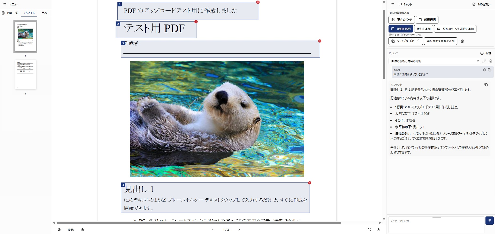
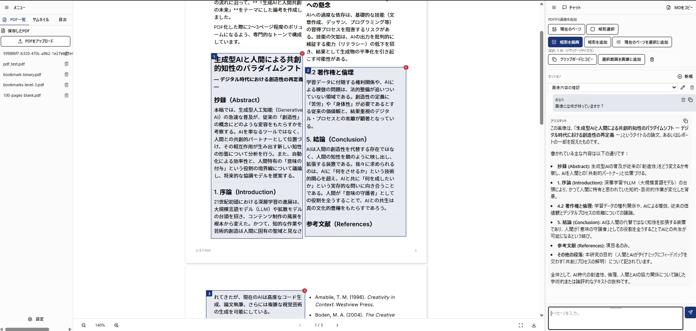
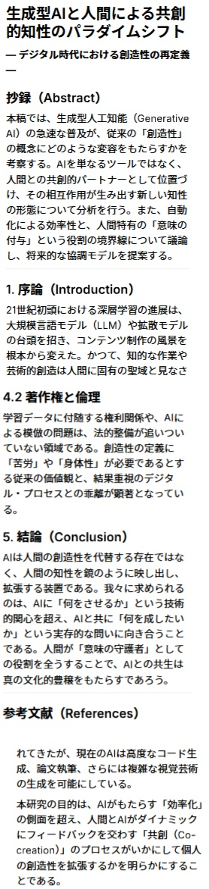
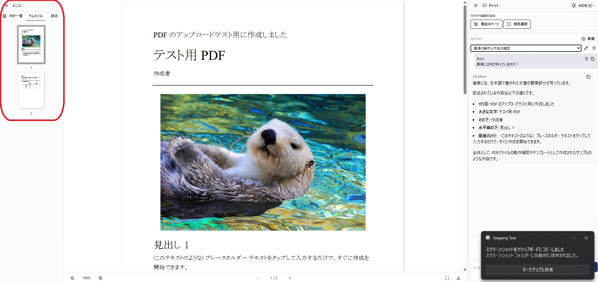
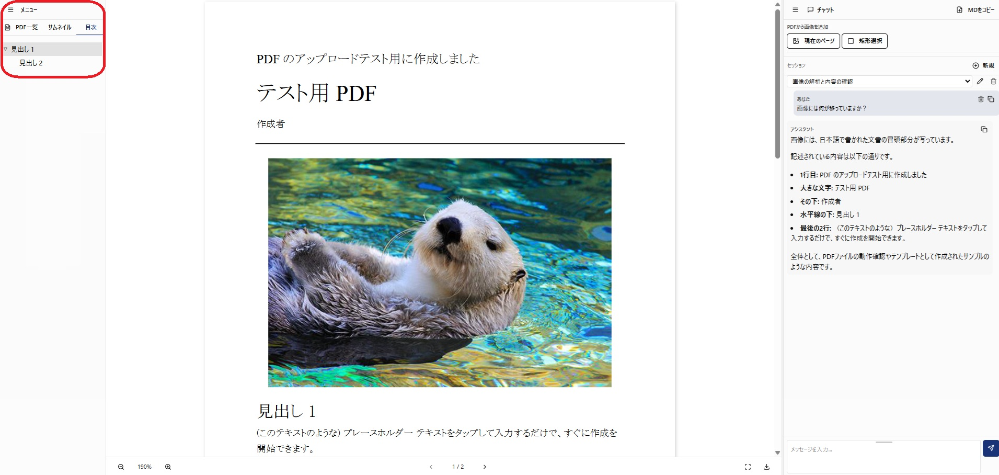
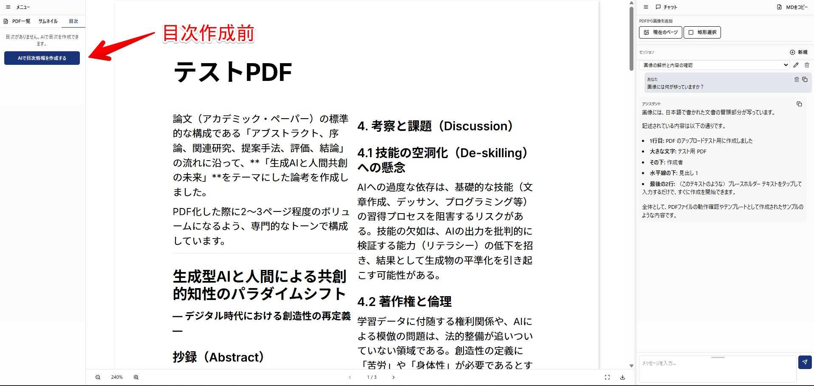
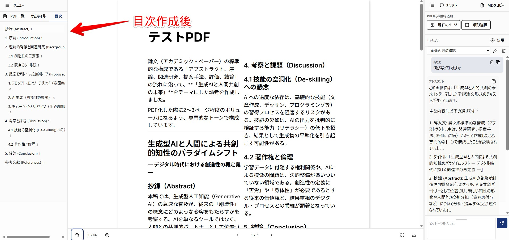
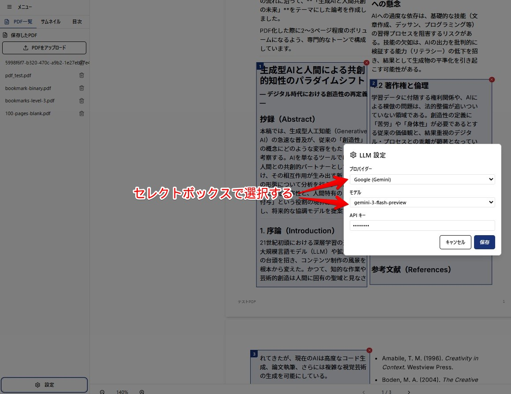

# PDF × LLM チャット 要約 アプリ

**PDF の「読んでほしい順」を指定して AI に送れるアプリです。**  
画像で送るので回答は短く出しやすい。2 段組み・ページまたぎの PDF も、順番をあなたが決めて送れます。



## 背景

PDF は 2 段組み・縦横混在・ページまたぎなどで、そのままスクショするだけだと AI に読む順が伝わりにくいことがあります。このアプリでは**範囲と順番を UI で指定してから 1 枚にまとめて送る**ので、意図したとおりに AI が読めます。

## 一目でわかる「できること」

**範囲を選ぶ → 順番を決める → 1 枚で送る。** そうすると AI に読む順が伝わるので、短く答えが返ってきやすいです。

そのほか、目次・サムネイルの表示（目次がない PDF は AI で自動作成）、使えるモデル一覧の取得と設定もできます。

## メイン機能

### 矩形選択＆画像取得

複雑なレイアウトの PDF でも、**「ここを読んで」** と伝えたい範囲だけを選べます。

1. **矩形選択**ボタンで選択モードにする
2. 画面上で**矩形を描く**か「矩形を追加」で範囲を足す（複数ページ・複数矩形 OK）
3. **選択範囲を画像として追加**で、その範囲が 1 枚の画像になりチャットに添付される

→ 表・図・特定段落だけを AI に渡せるので、要約が短く、欲しい答えに近づきやすいです。



矩形を選択する



選択した内容をクリップボードに張った結果

### サムネイルと目次（!!AIで自動作成機能付き!!）

- 左サイドバーで **サムネイル**（ページ一覧）と **目次** を表示できます。


サムネイルのスクリーンショット

  
目次のスクリーンショット

- **目次**は、PDF に目次情報が含まれている場合はそれを表示。
- **含まれていない場合**は「AI で目次を作成」から、LLM が PDF の構成を解析して**目次を自動作成**します。作成した目次は保存され、クリックで該当ページにジャンプできるようになります。


自動目次作成前


自動目次作成後

### LLM のプロバイダ・モデルをサーバーから取得して設定

チャットに使う AI は、設定画面でプロバイダ（OpenAI / Google など）とモデルを選び、API キーを入力して保存すれば使えます。選べる一覧はサーバーから取得します。



LLM 設定画面のスクリーンショット

### その他の機能

- **PDF**: アップロード、一覧、表示。ページ送り・ズーム・全画面・ダウンロード
- **チャット**: 選択した画像や PDF の内容をもとに AI と会話（プロバイダ・API キーは上記設定で指定）

## 実動作


## 構成

- **クライアント**: Vite (Rolldown) + React 19 + TypeScript, Tailwind v4, shadcn/ui, Vercel AI SDK, Streamdown, Zustand, wouter
- **サーバー**: FastAPI, SQLAlchemy, LiteLLM, PostgreSQL
- **DB**: PostgreSQL

## 開発

### 必要な環境

devcontainer で開くと Python + Node + PostgreSQL が立ち上がります。

- **Python**: uv 利用（`.python-version` で 3.13）
- **Node**: proto + bun（クライアントは `client/.prototools` で bun）

### 起動

**サーバー**

```bash
cd server && uv sync && uv run uvicorn app.main:app --host 0.0.0.0 --port 8000
```

**クライアント**

```bash
cd client && bun install && bun run dev
```

- 初回は devcontainer で PostgreSQL が起動し、`schema.sql` が実行されます。
- `/api` は Vite プロキシで `http://localhost:8000` に飛びます。別オリジンにする場合は `VITE_API_URL` を設定。
- DB 接続先は `DATABASE_URL` で変更できます（devcontainer 内は `pdf-viewer-db:5432`）。

## ライセンス

MIT
